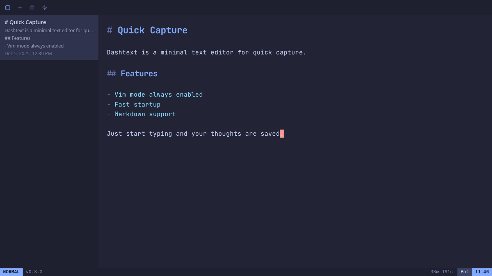

# DashText

A text editor for quick capture, inspired by [Drafts](https://getdrafts.com/).

## About

DashText is a desktop app for quickly capturing text that you'll process later. It's Drafts for people who aren't on Apple platforms (or prefer vim keybindings).

Currently focused on fast draft capture with vim-style editing. Processing and actions coming in future releases.

> [!NOTE]
> This is an early, opinionated personal project. I built it because I wanted a Drafts-like app for Linux that fits my workflow. It's shaped by my preferences, though I'd love for it to be useful to others someday, maybe.

## Features



- Quick capture window for rapid note-taking
- Vim keybindings always enabled (via CodeMirror 6)
- Tokyo Night theme
- Lazyvim-inspired layout with sidebar
- Local SQLite storage for drafts
- Word and character count
- Linux-focused (other platforms should work but are untested)

## Installation

Binaries coming soon. For now, build from source.

### From Source

#### Requirements

- [Bun](https://bun.sh/)
- [Rust](https://rustup.rs/)
- Platform-specific Tauri dependencies ([see Tauri docs](https://v2.tauri.app/start/prerequisites/))

#### Setup

```bash
git clone https://github.com/joshuadavidthomas/dashtext.git
cd dashtext
bun install
```

#### Building and Installation

Build the application and copy the binary to somewhere on your `PATH`:

```bash
bun run tauri build
cp src-tauri/target/release/dashtext ~/.local/bin/
```

Optionally, create a desktop entry at `~/.local/share/applications/dashtext.desktop`:

```ini
[Desktop Entry]
Name=DashText
Comment=A text editor for quick capture
Exec=dashtext
Type=Application
Categories=Utility;TextEditor;
```

There's no icon yet. If you'd like one, [Icon Kitchen](https://icon.kitchen/) can generate one for you.

## Someday/Maybe

- [ ] Tray icon / global hotkey for quick capture
- [ ] Draft actions/processing (similar to Drafts)
- [ ] Built-in actions for common workflows
- [ ] Scripting support for custom actions
- [ ] Vim configuration options
- [ ] Custom themes
- [ ] User settings
- [ ] Windows and macOS testing
- [ ] Web version
- [ ] Cross-device sync

## Contributing

PRs are welcome, though I may be slow to review. This project uses:

- **Frontend**: SvelteKit + Svelte 5, Tailwind CSS v4, shadcn-svelte
- **Editor**: CodeMirror 6 with @replit/codemirror-vim
- **Backend**: Tauri v2 (Rust)
- **Database**: SQLite via Drizzle ORM

## Acknowledgments

Inspired by [Drafts](https://getdrafts.com/) for iOS and macOS.

## License

DashText is licensed under the Apache License, Version 2.0. See the [`LICENSE`](LICENSE) file for more information.
