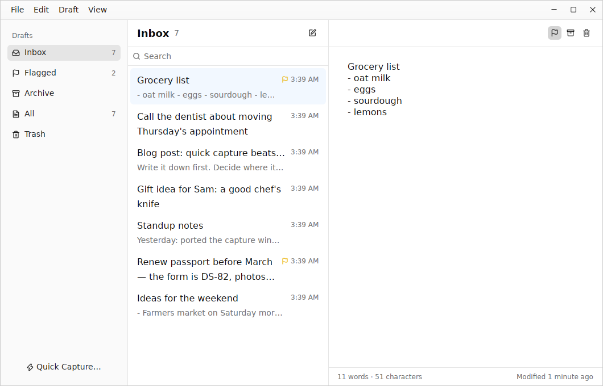
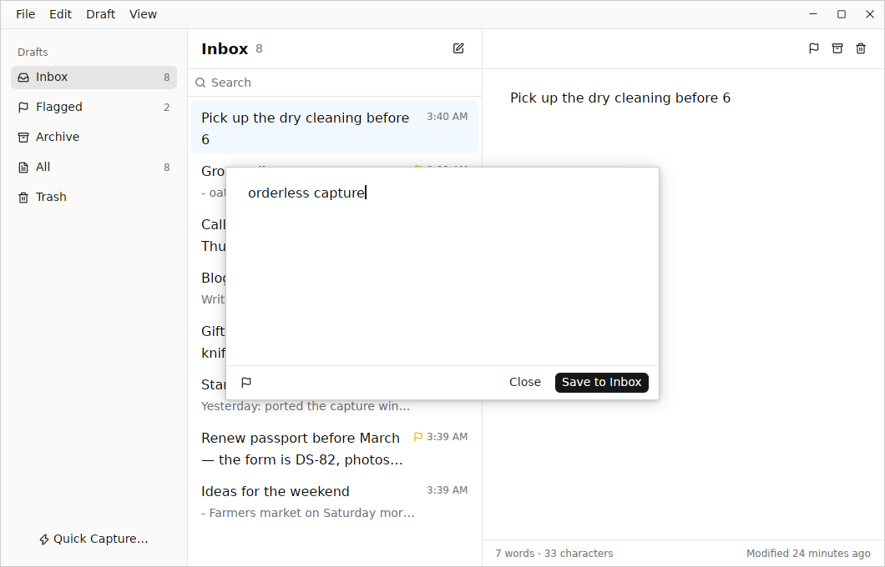

# Dashtext

Quick capture for plain text, inspired by [Drafts](https://getdrafts.com/).

## About

Dashtext is a place to put text first and decide what to do with it later. Press a shortcut, type, save — the draft lands in your inbox. Come back when you have time to process it.

It is an open-source, cross-platform take on Drafts, written in Rust with [GPUI](https://www.gpui.rs/) and [GPUI Component](https://github.com/longbridge/gpui-component). Linux is the first-class target; macOS and Windows should work but are not yet tested.

> [!NOTE]
> This is an early, opinionated personal project. Version 0.4 is a ground-up rewrite; nothing from the Tauri-based 0.3 releases carries over, including their data.

## Features



- **Quick capture window** — a small window for getting text down (a floating panel on macOS). `Ctrl+Enter` saves to the inbox; `Esc` closes it and keeps the text for next time, even across restarts.
- **Inbox, Flagged, Archive, All and Trash** — drafts live in one folder at a time; flags work across folders. The trash empties itself after 30 days.
- **An editor that stays out of the way** — every draft is plain Markdown text. It saves as you type, the first line becomes the title, and empty drafts are discarded instead of piling up.
- **Search** — words must all match, `"quoted phrases"` match exactly, `-word` excludes.
- **Keyboard first** — every command has a shortcut, and the shortcuts are listed in the menus.
- **Command line** — `dashtext capture` opens the capture window in the running app; `dashtext new` adds a draft without opening anything.



## Usage

```text
dashtext                      Open the drafts window
dashtext capture              Open the quick capture window
dashtext new "Call Sam"       Add a draft to the inbox
echo "from a pipe" | dashtext new --flag
```

A second `dashtext` hands its request to the running instance, so `dashtext capture` opens instantly once the app is running.

### Global capture shortcut

Wayland does not let applications grab global shortcuts themselves, so bind one in your desktop environment to run `dashtext capture`:

- **GNOME**: Settings → Keyboard → Keyboard Shortcuts → Custom Shortcuts
- **KDE Plasma**: System Settings → Shortcuts → Add New → Command
- **Sway / i3**: `bindsym $mod+Shift+d exec dashtext capture`
- **Hyprland**: `bind = SUPER SHIFT, D, exec, dashtext capture`

### Keyboard shortcuts

| Command | Shortcut |
| --- | --- |
| New draft | `Ctrl+N` |
| Quick capture | `Ctrl+Shift+N` |
| Search drafts | `Ctrl+F` |
| Back to the list from the editor | `Esc` |
| Flag / unflag | `Ctrl+Shift+L` |
| Archive / move to inbox | `Ctrl+Shift+A` |
| Move to trash / restore | `Ctrl+Shift+Backspace` |
| Delete permanently (in the trash) | `Ctrl+Shift+Delete` |
| Inbox, Flagged, Archive, All, Trash | `Ctrl+1` … `Ctrl+5` |
| Save capture | `Ctrl+Enter` |

On macOS, `Cmd` replaces `Ctrl`.

### Where your drafts live

Drafts are stored in a SQLite database following the XDG Base Directory specification:

| What | Linux |
| --- | --- |
| Draft library | `$XDG_DATA_HOME/dashtext/library.db` (usually `~/.local/share/dashtext/`) |
| Instance socket | `$XDG_RUNTIME_DIR/dashtext/dashtext.sock` |

macOS uses `~/Library/Application Support/app.dashtext.Dashtext/` and Windows uses `%APPDATA%\dashtext\Dashtext\data\`.

## Installation

Binaries are not published yet. To build from source you need [Rust](https://rustup.rs/) and the native libraries GPUI uses. On Debian or Ubuntu:

```bash
sudo apt install build-essential clang cmake pkg-config \
  libfontconfig-dev libfreetype-dev libwayland-dev \
  libx11-xcb-dev libxkbcommon-dev libxkbcommon-x11-dev libvulkan1
```

Then:

```bash
git clone https://github.com/joshuadavidthomas/dashtext.git
cd dashtext
cargo build --release
install -Dm755 target/release/dashtext ~/.local/bin/dashtext
install -Dm644 resources/linux/app.dashtext.Dashtext.desktop \
  ~/.local/share/applications/app.dashtext.Dashtext.desktop
```

The desktop entry includes a *Quick Capture* action, so launchers and docks can open the capture window directly.

## Troubleshooting

### It feels slow

Dashtext draws with the GPU through Vulkan. Without a Vulkan driver (in many VMs and remote desktops, for example), it falls back to llvmpipe, which draws every frame on the CPU. Typing and scrolling then lag no matter how fast your CPU is, and Dashtext shows a *No GPU acceleration* notice. Set `DASHTEXT_ALLOW_EMULATED_GPU=1` to hide it.

- Run `vkcube` (from `vulkan-tools`) to check that Vulkan works.
- On machines with two GPUs, choose one with `DRI_PRIME=1`, or with `ZED_DEVICE_ID=0x…` using the device ID shown by `lspci -nn | grep VGA`. Dashtext uses Zed's renderer, so Zed's [GPU troubleshooting](https://zed.dev/docs/linux#zed-fails-to-open-windows) applies too.
- Debug builds are much slower than `cargo build --release`.

### Building runs out of memory

The release profile uses thin LTO with a single codegen unit. On small machines, build with `cargo build --profile release-fast` instead: it is still optimized, but it compiles in parallel without LTO.

## Roadmap

Tracked with [bd](https://github.com/steveyegge/beads) in `.beads/`. Highlights:

- Tags, and workspaces built on them (saved filters with their own sort)
- Actions: scriptable steps that send a draft somewhere (the scripting runtime is still undecided — WASM, Lua or JavaScript)
- Version history for drafts
- Markdown syntax highlighting and preview
- Global shortcut via the XDG GlobalShortcuts portal
- Import and export of Markdown files
- Sync, and eventually mobile apps

## Contributing

PRs are welcome, though I may be slow to review. The code is a Cargo workspace:

- `crates/dashtext-core` — the draft model and SQLite storage, with no UI dependencies
- `crates/dashtext` — the desktop app (GPUI and GPUI Component)

The toolchains and tools come from [devenv](https://devenv.sh/), so you need [Nix](https://nixos.org/download/) and devenv. [direnv](https://direnv.net/) is optional: with it, `direnv allow` loads the environment whenever you `cd` into the repository. Without it, run `devenv shell`.

Run `just` to see the development commands (`just test`, `just clippy`, `just fmt`), and `devenv test` to run everything CI checks.

## Acknowledgments

Inspired by [Drafts](https://getdrafts.com/) by Agile Tortoise.

## License

Dashtext is licensed under the Apache License, Version 2.0. See the [`LICENSE`](LICENSE) file for more information.
